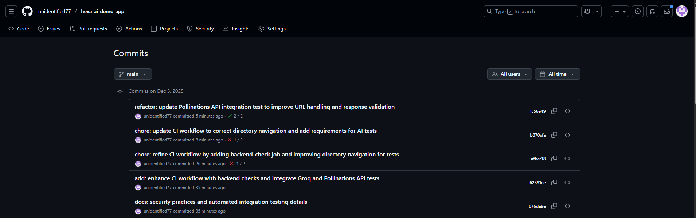

# 🎨 Hexa - AI Logo & Art Generator (Case Study)

This repository contains a demo mobile application that simulates an AI-powered logo generation workflow using **React Native Expo** for the frontend and **Firebase Cloud Functions (Python)** for the backend.

> 🚀 **Beyond Requirements & Nice-to-Haves**
>
> This project goes beyond the basic assignment requirements by implementing production-grade practices:
> * **Real AI Integration:** Instead of static mock data, it integrates **Groq (Llama 3)** and **Pollinations.ai** to generate unique, creative prompts and actual images.
> * **CI/CD Pipeline:** A **GitHub Actions** workflow is established to enforce code quality (Linting, TypeScript checks,AI API checks) and verify builds on every push.
> * **Event-Driven Architecture:** Utilizing Firestore real-time listeners (`onSnapshot`) ensures a reactive UI that responds instantly to backend state changes, rather than simple HTTP polling.
> * **Full UX Lifecycle (History & Share):** Unlike typical demos that reset after use, this app includes a **History** system to track past creations and native **Share/Save** functionality to distribute results.

## 🎥 Application Demo (Walkthrough)

This video demonstrates the full **Real-Time Generation Workflow**, from prompt creation to final image rendering using the AI backend.

> [**▶️ Watch Video Demo**](hexa-ai-logo-generator/assets/images/demo.mp4)

> ⚠️ **Note:** Since the video file is too large to stream directly on GitHub, please click **View Raw** or **Download** on the file page to watch it.

> ℹ️ **Functionality Note:** Tapping on any previously generated item in the **History** list correctly navigates to the **Output Screen**. (This interaction was inadvertently omitted from the video recording but is fully functional).

### 🔐 Security & Automated Integration Testing

To maintain security best practices while ensuring external services are active, the following strategy was implemented:

* **Secrets Management:** Sensitive API Keys (e.g., `GROQ_API_KEY`) injected dynamically via **GitHub Actions Secrets** during the CI process.
* **Integration Tests:** Python scripts (`test_groq.py`, `test_pollinations.py`) are executed in the CI pipeline to verify connectivity with 3rd party AI APIs.
* **Fail-Fast Mechanism:** These scripts use `sys.exit(1)` upon failure, causing the CI pipeline to halt immediately if the AI services are unresponsive or if authentication fails.

This ensures that the deployed code always has valid access to necessary AI services without exposing credentials in the repository.


## 📱 Features

* **Real-time Generation Workflow:** Handles `Idle` -> `Processing` -> `Done/Failed` states using Firestore listeners.
* **AI-Powered "Surprise Me":** Uses **Groq (Llama 3)** to generate creative and detailed logo prompts based on selected styles.
* **Real Image Generation:** Uses **Pollinations.ai** to generate actual logos instead of placeholders.
* **History System:** Users can view their previously generated logos.
* **Share & Save:** Integrated functionality to share or save the generated results.
* **Robust Error Handling:** Simulates random failures (20% chance) to demonstrate error state management.

## 🏗 Architecture

The app follows an event-driven architecture, strictly separating frontend concerns from backend logic:

1.  **State Management:** Frontend uses a reactive approach. It creates a document in Firestore and sets up a real-time listener (`onSnapshot`). The UI state (`processing`, `done`, `failed`) is driven purely by database changes, not local timers.
2.  **Backend Logic:** Firebase Cloud Functions.
    * **Trigger:** Detects new job creation (`on_document_created`) when Create button is tapped.
    * **Generation:** Calls external AI APIs (Pollinations) and manages timeouts/errors.
    * **Storage:** Saves the binary image data to Firebase Storage and updates Firestore with the public URL.
```bash
+-------------+        1. Create Job         +-------------+
|   React     | ---------------------------> |  Firestore  |
| Native App  | <------- (Listener) -------- |     DB      |
+-------------+                              +-------------+
       ^                                            |
       | 4. Update UI                               | 2. Trigger
       |                                            v
+-------------+        3. Generate           +-------------+
|   Firebase  | <------- (Save URL) -------- |   Cloud     |
|   Storage   |                              |  Functions  |
+-------------+                              +-------------+
                                                    |
                                                    | 2a. Call AI
                                                    v
                                             +-------------+
                                             |  Groq &     |
                                             | Pollinations|
                                             +-------------+
```
## 🚀 Setup & Installation

### Prerequisites
* Node.js & npm/yarn
* Python 3.11+
* Firebase CLI
* Expo Go app (for testing on device)
* Git

### 1. Frontend Setup
```bash
# Clone the repository
git clone <repository-url>
cd <repository-folder>
cd hexa-ai-logo-generator
# Install dependencies
npm install
# Start the app
npx expo start
```

### 2. Backend Setup (Cloud Functions)

⚠️ **Important:** You must configure the API Key and select your own Firebase project for the backend to work.

#### Step 1: Configure API Key
1.  **Get a Free API Key:** Sign up at [Groq Console](https://console.groq.com/), log in, and navigate to "API Keys" to create a new key.
2.  **Create Environment File:**
    * Navigate to the `hexa-ai-logo-generator/functions/` folder inside the project.
    * Add your key inside `.env` file:
    ```env
    GROQ_API_KEY=gsk_your_generated_key_here
    ```

#### Step 2: Python Environment Setup
Open your **Terminal** or **Command Prompt** (or use the VS Code Terminal) and navigate to the `hexa-ai-logo-generator/functions` directory:

```bash
cd functions
```

```bash
#For Windows
# Create virtual environment
python -m venv venv

# Activate it
venv\Scripts\activate

# Install dependencies
pip install -r requirements.txt
```

```bash
#For macOS / Linux:
# Create virtual environment
python3 -m venv venv

# Activate it
source venv/bin/activate

# Install dependencies
pip install -r requirements.txt
```

Step 3: Firebase Project Setup & Deploy
Still in the Terminal (inside the functions folder), connect the code to your own Firebase project.

Login to Firebase: (This opens a browser window to login with your Google account)
```bash
firebase login
```
Select Your Project:

Run the command below.

Use arrow keys to select "Create a new project" (or choose an existing one you own) and press Enter. Alias suggestion: If asked for an alias, type default.

```bash
firebase use --add
```
> 💡 **Post-Setup Requirement:**
> After creating a new project, please ensure the following are enabled in the [Firebase Console](https://console.firebase.google.com/):
> 1.  **Authentication:** Enable **Anonymous** sign-in provider.
> 2.  **Firestore Database:** Create database (Start in **Test Mode**).
> 3.  **Storage:** Get started (Start in **Test Mode**).

Deploy: Once your project is linked, deploy the functions:

```bash
firebase deploy --only functions
```

## ⚙️ CI/CD & Automated Testing Pipeline

To ensure code integrity and prevent broken deployments, a comprehensive **GitHub Actions** pipeline has been established. This pipeline runs on every push to the `main` branch.

### Pipeline Stages:
1.  **Frontend Quality:**
    * **Linting:** Enforces strict code style rules.
    * **Type Checking:** Runs `tsc` to catch TypeScript errors early.
2.  **Backend Integration Tests (Python):**
    * **AI Service Health Checks:** Executes isolated Python scripts (`test_groq_ai.py`, `test_pollinations_ai.py`) to verify that external AI APIs (Groq & Pollinations) are responsive.
    * **Secrets Management:** Uses **GitHub Secrets** to inject API keys securely during testing, ensuring no sensitive keys are exposed in the build logs.


*Figure: Successful execution of both Frontend (Lint/Type) and Backend (API Integration) workflows.*

## 📝 Trade-offs & Assumptions

* **Styling:** I chose to use React Native's built-in `StyleSheet` API instead of a utility library like Tailwind (NativeWind).
    * **Trade-off:** Writing styles took slightly longer, but it ensured zero dependencies and full control over the specific Figma implementation without extra build configuration.
* **Auth Strategy:** The app currently uses **Firebase Anonymous Auth**.
    * **Assumption:** For a demo/case study, frictionless entry is prioritized over user registration.
* **Security vs. Convenience:** API Keys are **not** hardcoded in the repository.
    * *Decision:* The `.env` file is included for setup convenience, but you must replace the placeholder with your own valid API Key to run the backend locally. Meanwhile, the **CI/CD pipeline** is fully configured with **GitHub Secrets** to demonstrate secure credential management in a production environment.

## 🚧 Known Limitations & Future Improvements

If I had more time, I would focus on the following areas:

1.  **Production-Grade Auth:** Replace Anonymous Auth with Google/Apple Sign-In to allow users to access their history across devices.
2.  **Enhanced CI/CD:** While linting is set up, I would add **Maestro UI tests** to the GitHub Actions pipeline to automate end-to-end testing of the "Generate -> Output" flow.
3.  **Image Generation Queue:** Currently, the Cloud Function runs directly. For high traffic, I would decouple this using **Google Cloud Pub/Sub** to handle generation requests asynchronously and prevent timeouts.
4.  **UI Polish:** Add skeleton loaders for images in the History screen for a smoother perceived performance.

## 🧪 Testing

During development, isolated Python scripts (`test_groq.py`, `test_pollinations.py`) were used to verify AI API integrations before connecting them to the Cloud Functions.

## 🤖 AI Usage

For a detailed breakdown of how AI tools (ChatGPT, Gemini) were used to assist in this project, please refer to [AI_USAGE.md](./AI_USAGE.md).

